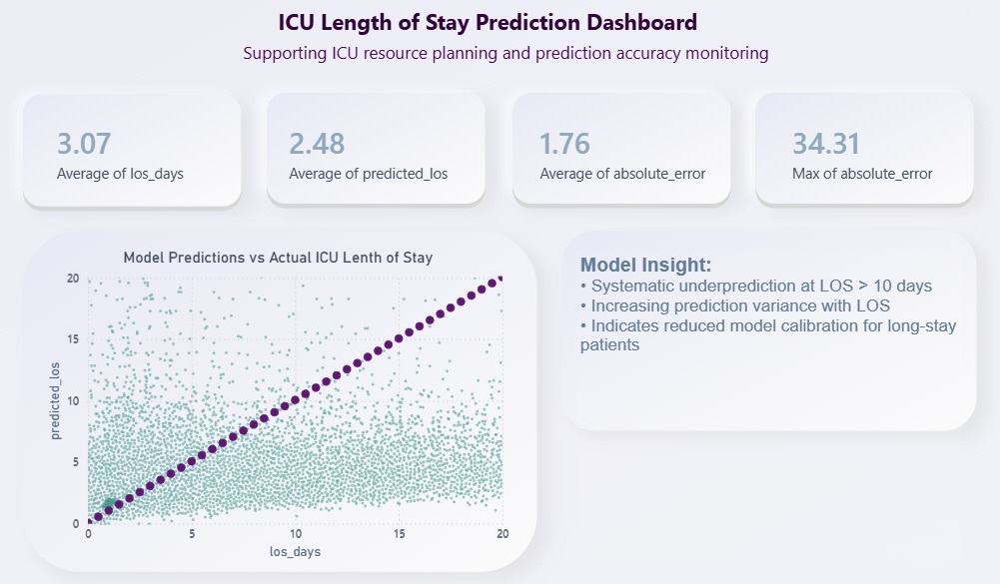

# ICU Length of Stay Prediction & Model Evaluation using BigQuery ML


---
 

This dashboard bridges technical model outputs with clinical and operational decision-making.

---
## 📌 Project Overview

This project develops an **end-to-end machine learning pipeline** to predict **ICU Length of Stay (LOS)** using clinical and administrative data from the **MIMIC-IV dataset**.

The solution is implemented entirely in **BigQuery ML**, demonstrating how scalable SQL-based ML can be used in healthcare analytics.

---

## 🎯 Business Impact

Accurate prediction of ICU LOS enables healthcare providers to:

- 🏥 **ICU Operations:** Optimize ICU bed utilization  
- 👩‍⚕️ **Staffing & Resources:** Improve planning and allocation  
- 🔄 **Patient Flow:** Reduce bottlenecks and delays  
- 💰 **Cost Efficiency:** Support cost-effective hospital operations  

This type of solution is directly applicable to healthcare systems such as **M42**, **Cleveland Clinic Abu Dhabi**, and other data-driven hospitals.

---

## 📊 Dataset

- **Source:** MIMIC-IV (PhysioNet)
- **Population:** ICU patients
- **Target Variable:** Length of Stay (LOS) in days
- **Challenge:** Right-skewed distribution of LOS

✔ **Solution:** Applied log transformation to stabilize variance and improve model performance

---

## ⚙️ Methodology

### 1. Data Processing
- Extracted ICU stays from raw clinical tables
- Cleaned missing and inconsistent values
- Filtered LOS between 0–30 days to remove extreme outliers

### 2. Feature Engineering
Key features include:
- Demographics: age, gender  
- Clinical context: admission type, care unit  
- Clinical complexity: number of procedures  
- Diagnosis grouping  

### 3. Model Development
- **Model:** Linear Regression (BigQuery ML)
- **Target:** Log-transformed LOS
- **Rationale:** Improve stability and handle skewed distribution

### 4. Evaluation
- Metric: **Mean Absolute Error (MAE)**
- Evaluation performed on predicted vs actual LOS

---

## 📈 Results

The model achieves good overall performance (MAE: 1.76 days), 
but performance decreases for longer ICU stays.

**Model evaluation reveals:**
- Increasing prediction variance as LOS increases  
- Systematic underprediction for LOS > 10 days  
- Reduced calibration for long-stay patients

   ### 🧠 Model Evaluation Approach

Beyond standard error metrics, model performance was evaluated using 
visual analysis of predicted vs actual values.

A reference line (y = x) was used to assess calibration and identify 
systematic deviations in model predictions.

This approach enables deeper understanding of where the model performs well 
and where it fails — critical for real-world healthcare applications.
  
### 🔍 Key Predictive Features
- Admission type  
- Number of procedures  
- Care unit  
- Patient demographics  

---
## 📊 Dashboard (Power BI)

A Power BI dashboard was developed to translate model outputs into actionable insights.

Key capabilities:
- Visual comparison of predicted vs actual ICU LOS
- Model calibration assessment using reference line (y = x)
- Monitoring of prediction error metrics (MAE, max error)
- Identification of model limitations in long-stay patients 

Tools:
- Power BI  
- Google BigQuery integration

  ### 📊 Power BI Dashboard – Model Evaluation

To support interpretability and real-world adoption, a Power BI dashboard was developed to visualize model performance and prediction behavior.

#### Key Visuals:

- **Actual vs Predicted LOS Scatter Plot**  
  Enables direct comparison between predicted and actual ICU length of stay.

- **Reference Line (y = x)**  
  A perfect prediction line is overlaid to assess model calibration and deviation.

- **Model Performance KPIs**  
  - Average LOS  
  - Predicted LOS  
  - Mean Absolute Error (MAE)  
  - Maximum Error  

- **Insight Panel**  
  Highlights key model behavior for decision-makers.

#### Key Findings:

- Model shows **systematic underprediction for LOS > 10 days**
- **Prediction variance increases** with longer ICU stays
- Indicates **reduced model calibration for long-stay patients**

These insights are critical for identifying limitations of the model and guiding further improvements.

---
### 💡 Why This Matters

- This project demonstrates how machine learning models in healthcare must be evaluated beyond accuracy metrics.
- Understanding where models fail — particularly in long-stay ICU patients — is critical for safe and effective real-world deployment.

---
## 🧠 Key Insight

Applying a **log transformation** to ICU LOS improves model performance by addressing the strong right-skew commonly observed in hospital stay data.

This simple transformation leads to **more reliable and stable predictions**, especially for longer stays.

---

## 📁 Project Structure

```text
sql/
├── 01_extract_data.sql
├── 02_clean_data.sql
├── 03_build_dataset.sql
├── 04_engineer_features.sql
├── 05_finalize_features.sql
├── 06_train_model_log.sql
├── 07_generate_predictions.sql
├── 08_evaluate_model_mae.sql
├── 09_analyze_feature_importance.sql
```
## ▶️ How to Run
1. 📥 **Load Data**
   - Import MIMIC-IV dataset into BigQuery  

2. 🧹 **Run Data Pipeline**
   - Execute SQL scripts in order:
     - `01_extract_data.sql`
     - `02_clean_data.sql`
     - `03_build_dataset.sql`
     - `04_engineer_features.sql`
     - `05_finalize_features.sql`

3. 🤖 **Train Model**
   - Run `06_train_model_log.sql` using BigQuery ML  

4. 📊 **Generate Predictions**
   - Execute `07_generate_predictions.sql`  

5. 📈 **Evaluate Performance**
   - Run `08_evaluate_model_mae.sql`  
   - Review MAE and error metrics  

6. 🔍 **Analyze Results**
   - Execute `09_analyze_feature_importance.sql`  

## 🚀 Future Improvements
Compare with advanced models (e.g., XGBoost, Random Forest)
Include time-series clinical variables (vitals, labs)
External validation on other hospital datasets
Integration into hospital dashboards (e.g., Power BI)

## 👩‍💻 Author
**Olga Karachyntseva**  
**Health Economics & Data Analytics | Healthcare ML**
Bridging clinical data, machine learning, and health economics to support data-driven decision-making in healthcare systems.
