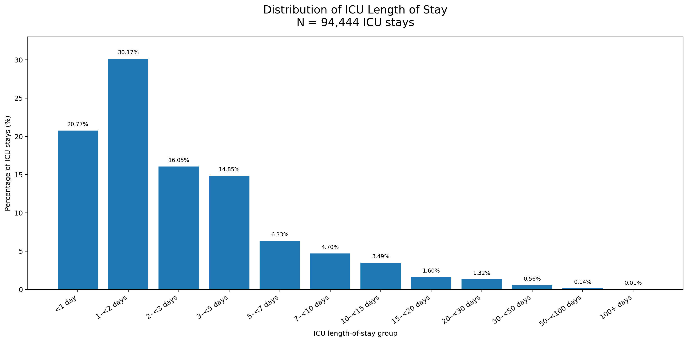
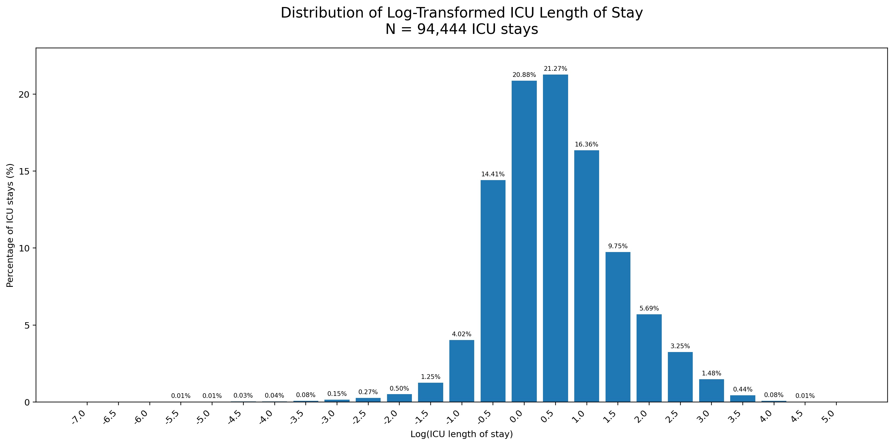
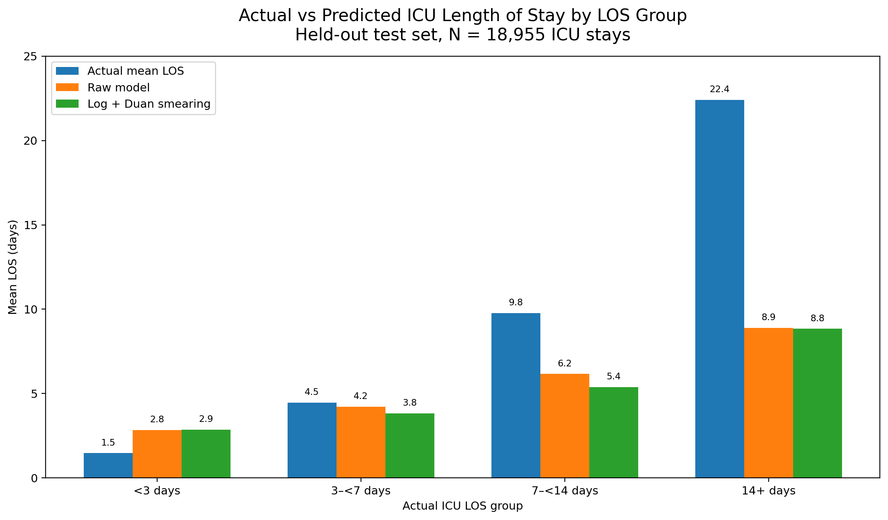

# ICU Length-of-Stay Prediction & Model Evaluation using BigQuery ML

---
**A retrospective MIMIC-IV proof-of-concept exploring ICU length-of-stay prediction, retransformation bias, prolonged-stay error, and the potential value of prediction for ICU resource planning.**

The updated analysis compares raw and log-transformed LOS models on the same held-out cohort, evaluates Duan smearing correction, examines performance across LOS strata and diagnosis groups, and identifies persistent underprediction of prolonged ICU stays.

> **Key finding:** Improving the statistical distribution of LOS does not necessarily improve prediction on the original day scale. The most persistent modelling challenge was the prolonged-stay tail.

---
## 📌 Project Overview

This project is a retrospective proof-of-concept study using de-identified **MIMIC-IV critical care data** to explore **ICU length-of-stay (LOS)** prediction.

The project demonstrates how routinely available clinical and administrative variables can be used to develop and evaluate a SQL-based prediction modelling workflow in **BigQuery ML**.

This project is not intended to present a clinically ready AI tool. Instead, it uses preliminary proof-of-concept work as a foundation for further methodological development, including model validation, error analysis, decision-support framing, and evaluation of potential clinical, operational, and economic value.

---
## Important Note

This project is a retrospective, educational, and methodological proof-of-concept using de-identified MIMIC-IV critical care data. It is not intended for clinical decision-making and has not been prospectively implemented, externally validated, or tested in a real-world hospital workflow.

The purpose of this project is to explore prediction modelling methods and to identify how ICU length-of-stay predictions could potentially be evaluated for clinical, operational, and economic value in future research.

---

## Data Readiness and Real-World Implementation

This project uses MIMIC-IV, a structured and de-identified critical care research dataset. While this supports proof-of-concept modelling, real-world deployment of ICU prediction tools would require careful assessment of data readiness.

In hospital settings, relevant ICU data may be distributed across electronic health records, ICU monitoring systems, laboratory systems, medication records, and administrative platforms. For AI-enabled decision support, data integration alone may not be sufficient. Data also need to be unified, harmonized, deduplicated, time-aligned, and structured for reliable analytics and model development.

This highlights an important implementation consideration: the value of AI-enabled ICU decision support depends not only on model performance, but also on the quality, interoperability, and usability of the underlying clinical data infrastructure.

---
## 📊 Dataset

- **Source:** MIMIC-IV (PhysioNet)
- **Population:** ICU stays
- **Analytical cohort:** 94,444 unique ICU stays
- **Target variable:** ICU length of stay (LOS) in days
- **Median LOS:** 1.97 days
- **Mean LOS:** 3.63 days
- **P90:** 7.92 days
- **P95:** 12.68 days
- **P99:** 26.44 days
- **Maximum observed LOS:** 226.40 days

The raw ICU LOS distribution was strongly right-skewed. Log transformation substantially reduced this asymmetry, but the updated analysis showed that improved distributional behaviour did not automatically translate into better prediction performance on the original day scale.

| Outcome scale | Skewness |
|---|---:|
| Raw ICU LOS | **6.25** |
| Log-transformed ICU LOS | **0.14** |

### Raw ICU LOS distribution

Most ICU stays were relatively short, while a progressively smaller proportion extended into a long right tail.

### Log-transformed ICU LOS distribution

The log transformation produced a substantially more symmetric outcome distribution.

---
## ⚙️ Methodology

### 1. Cohort Construction

ICU stays were extracted from MIMIC-IV and linked with demographic, admission, procedure, care-unit, and diagnosis information.

The updated analytical cohort contains **94,444 unique ICU stays** with complete LOS information.

Unlike the earlier proof-of-concept analysis, the updated analysis retains the **full observed LOS range** rather than excluding stays above 30 days. This was done to investigate whether previously observed underprediction was driven by exclusion of prolonged ICU stays.

### 2. Feature Engineering

The modelling dataset includes:

- Age at ICU admission
- Gender
- Admission type
- First ICU care unit
- Number of procedures
- Principal diagnosis group

The same predictor set was used for the pooled raw-LOS and log-LOS comparison models.

### 3. Train/Test Design

A fixed train/test split was used for the updated model comparison:

| Dataset | ICU stays |
|---|---:|
| Training set | **75,489** |
| Test set | **18,955** |
| Total | **94,444** |

There was **no overlap** between training and test ICU stays.

Both comparison models were trained on exactly the same training observations and evaluated on exactly the same held-out test observations.

### 4. Raw vs Log-Transformed LOS Models

Two linear regression models were developed in BigQuery ML using identical predictors:

- **Raw LOS model:** directly predicts ICU LOS in days
- **Log LOS model:** predicts the natural logarithm of ICU LOS

The purpose of this comparison was to test whether the substantial improvement in distributional symmetry after log transformation also translated into better predictive performance on the original day scale.

### 5. Retransformation to Days

Predictions from the log-scale model were evaluated using two approaches:

1. **Naive retransformation**

   `predicted LOS = exp(predicted log LOS)`

2. **Duan smearing correction**

   A smearing factor was estimated using residuals from the training data only:

   **Duan smearing factor = 1.4153**

   Corrected predictions were calculated as:

   `predicted LOS = exp(predicted log LOS) × 1.4153`

This approach was used to assess and reduce retransformation bias without using information from the held-out test set.

### 6. Model Evaluation

Models were compared on the same **18,955 held-out ICU stays** using:

- Mean Absolute Error (MAE)
- Root Mean Squared Error (RMSE)
- Mean prediction bias
- R²
- Error stratification by actual LOS
- Performance across major diagnosis groups

Additional analyses examined prolonged ICU stays and diagnosis-specific modelling to determine whether underprediction was primarily related to outcome transformation, patient heterogeneity, or the long-stay tail.

---

## 📈 Updated Results

### Overall Model Performance

All models were evaluated on the same **18,955 held-out ICU stays**.

| Model | MAE (days) | RMSE (days) | Bias (days) | R² |
|---|---:|---:|---:|---:|
| Log LOS – naive retransformation | **2.21** | 4.53 | -1.09 | 0.115 |
| Log LOS – Duan smearing | 2.37 | 4.61 | **-0.07** | 0.084 |
| Raw LOS model | 2.40 | **4.11** | +0.07 | **0.271** |

No single modelling approach performed best across all metrics.

The naive log model achieved the lowest overall MAE, but it showed systematic downward bias. Duan smearing substantially reduced this overall bias. The raw-scale model achieved the lowest RMSE and highest R², although it produced 140 non-positive LOS predictions, which are not clinically plausible.

### Prolonged-Stay Performance

Aggregate metrics masked an important pattern: model error increased substantially with actual ICU length of stay.

| Actual LOS group | N | Mean actual LOS | Raw model prediction | Log + smearing prediction | Raw model MAE |
|---|---:|---:|---:|---:|---:|
| <3 days | 12,666 | 1.47 | 2.84 | 2.85 | 1.71 |
| 3–<7 days | 4,050 | 4.46 | 4.21 | 3.82 | 1.94 |
| 7–<14 days | 1,538 | 9.76 | 6.16 | 5.39 | 4.28 |
| 14+ days | 701 | **22.40** | **8.89** | **8.84** | **13.56** |

The major modelling limitation was persistent underprediction among prolonged ICU stays.

For patients staying **14 days or longer**, the mean observed LOS was **22.40 days**, while both the raw and smearing-corrected log models predicted approximately **8.9 days** on average.

This underprediction persisted even after:

- retaining the full observed LOS range;
- correcting retransformation bias;
- stratifying performance by diagnosis group.

### Diagnosis-Specific Modelling

LOS distributions differed meaningfully across major diagnosis groups. However, training separate broad diagnosis-specific models produced little overall improvement over the pooled model.

| Diagnosis-specific experiment | Pooled RAW MAE | Specific-model MAE |
|---|---:|---:|
| Infectious and parasitic diseases | 3.257 | 3.248 |
| Diseases of the circulatory system | **2.255** | 2.275 |

Diagnosis-specific models provided modest improvement in some prolonged-stay subgroups, but substantial underprediction remained.

For example, among infectious-disease patients with LOS ≥14 days:

- Mean actual LOS: **22.62 days**
- Pooled model prediction: **9.34 days**
- Infectious-specific prediction: **10.20 days**

Among circulatory patients with LOS ≥14 days:

- Mean actual LOS: **22.38 days**
- Pooled model prediction: **8.67 days**
- Circulatory-specific prediction: **9.22 days**

### Key Finding

The updated analysis suggests that the main challenge is not simply the choice between raw and log-transformed LOS.

**The most persistent modelling problem is identifying and accurately predicting the prolonged-stay tail.**

This is particularly important for future ICU decision-support and health-economic evaluation because long-stay patients may account for disproportionate bed occupancy, staffing requirements, resource use, and opportunity cost.

---
## 📊 Power BI Dashboard

A Power BI dashboard was developed during the initial proof-of-concept phase to translate prediction outputs into a more operationally interpretable format.

The dashboard supports:

- Visual comparison of predicted versus actual ICU LOS
- Identification of systematic prediction error
- Monitoring of model performance metrics
- Exploration of model behaviour among longer-stay patients

The dashboard should be interpreted as an **analytical prototype**, not as a clinically deployed decision-support tool.

The updated analysis presented above extends the original dashboard findings by formally examining:

- raw versus log-transformed LOS;
- retransformation bias;
- Duan smearing correction;
- performance across LOS strata;
- diagnosis-group heterogeneity;
- diagnosis-specific modelling.

### Why this matters

Prediction accuracy alone is not sufficient to establish the value of an ICU prediction model.

A model may perform reasonably well on average while still performing poorly for the patients who are most operationally important.

In this analysis, prolonged ICU stays represented a relatively small proportion of observations but showed substantially larger prediction errors. This distinction is particularly relevant when considering future applications in:

- ICU bed capacity planning
- staffing and resource allocation
- patient flow
- opportunity cost
- health-economic evaluation of AI-enabled decision support

### Updated analytical insight

Log transformation substantially improved the statistical distribution of ICU LOS, but it did not eliminate the key predictive limitation.

The central challenge identified in the updated analysis is the **persistent underprediction of prolonged ICU stays**.

Broad diagnosis-specific models provided only limited improvement, suggesting that future work should focus on richer predictors of prolonged ICU utilisation rather than relying solely on outcome transformation or broad diagnostic stratification.

---

## 📁 Project Structure

<pre>
mimic-icu-los-prediction/
│
├── README.md
├── LICENSE
├── figures/
│   ├── raw_los_distribution.png
│   ├── log_los_distribution.png
│   └── long_stay_prediction_performance.png
│
├── images/
│   └── Power BI dashboard and supporting visuals
│
├── sample_outputs/
│   └── Example aggregate outputs
│
└── sql/
    ├── 01–09  Initial proof-of-concept workflow
    ├── 10_compare_raw_vs_log_model_performance.sql
    ├── 11_model_performance_by_los_group.sql
    ├── 12_model_performance_by_diagnosis_group.sql
    ├── 13_duan_smearing_factor.sql
    ├── 14_train_updated_comparison_models.sql
    ├── 15_create_test_prediction_comparison.sql
    ├── 16_train_diagnosis_specific_models.sql
    └── 17_evaluate_diagnosis_specific_models.sql
</pre>

The original `01–09` scripts document the first proof-of-concept workflow. Scripts `10–17` document the updated validation analyses, including matched raw/log modelling, retransformation, prolonged-stay evaluation, and diagnosis-specific experiments.

## ▶️ How to Run

The project contains two stages:

1. **Initial proof-of-concept workflow (`01–09`)**
2. **Updated validation and sensitivity analyses (`10–17`)**

The updated analyses assume that the analytical ICU dataset and predefined train/test cohorts have already been created.

### Prerequisites

- Access to MIMIC-IV through PhysioNet
- Google Cloud / BigQuery
- BigQuery ML enabled
- Prepared analytical table: `mimic_results.icu_ml_dataset_rebuilt`
- Predefined training and test ICU stay IDs

The final analytical cohort contains **94,444 unique ICU stays**, divided into:

- **75,489 training stays**
- **18,955 held-out test stays**
- **0 overlap between training and test cohorts**

### Updated analysis workflow

### Step 1 — Train matched raw and log LOS models

Run `14_train_updated_comparison_models.sql`.

This creates two linear regression models using the same training observations and predictor set:

- Raw ICU LOS model
- Log-transformed ICU LOS model

Both models use `data_split_method = 'NO_SPLIT'` because the train/test cohorts were defined before model fitting.

### Step 2 — Calculate the Duan smearing factor

Run `13_duan_smearing_factor.sql`.

The smearing factor is estimated from **training residuals only**.

The observed factor in this analysis was **1.415317684**.

### Step 3 — Generate matched held-out predictions

Run `15_create_test_prediction_comparison.sql`.

This generates predictions for the same **18,955 held-out ICU stays** from:

- Raw LOS model
- Log LOS model with naive retransformation
- Log LOS model with Duan smearing correction

### Step 4 — Compare overall predictive performance

Run `10_compare_raw_vs_log_model_performance.sql`.

This calculates MAE, RMSE, mean prediction bias, and R² for all three prediction approaches.

### Step 5 — Evaluate performance across LOS groups

Run `11_model_performance_by_los_group.sql`.

Performance is examined separately for:

- <3 days
- 3–<7 days
- 7–<14 days
- 14+ days

### Step 6 — Evaluate performance across diagnosis groups

Run `12_model_performance_by_diagnosis_group.sql`.

This compares model behaviour across the six largest diagnosis groups in the held-out test cohort.

### Step 7 — Train diagnosis-specific models

Run `16_train_diagnosis_specific_models.sql`.

Separate raw-LOS models are trained for infectious/parasitic and circulatory diagnosis groups.

### Step 8 — Compare pooled and diagnosis-specific models

Run `17_evaluate_diagnosis_specific_models.sql`.

This evaluates whether diagnosis-specific modelling improves prediction overall or within prolonged-stay subgroups.

### Reproducibility note

The same held-out test cohort is used throughout the updated model comparison. No test-set outcomes are used for model training or estimation of the Duan smearing factor.

## 🎯 Research and Operational Relevance

ICU length-of-stay prediction is potentially valuable not simply because LOS can be estimated, but because better anticipation of resource-intensive stays may support more informed operational decisions.

The updated analysis suggests that the greatest modelling challenge lies in the **prolonged-stay tail** — the group of patients whose ICU utilisation may have disproportionate implications for bed occupancy, staffing, resource consumption, and patient flow.

Potential future applications include:

- **ICU capacity planning:** anticipating bed occupancy and pressure on constrained ICU capacity;
- **Staffing and resource allocation:** supporting planning for nursing, clinical, and other resource requirements;
- **Patient flow:** identifying patients who may contribute to prolonged bed occupancy or downstream bottlenecks;
- **Resource-use estimation:** linking predicted LOS with expected bed-days and other utilisation measures;
- **Health-economic evaluation:** assessing whether model-guided decisions generate sufficient operational or clinical benefit to justify implementation.

From a health-economics perspective, the important question is not only whether prediction error can be reduced, but whether improved prediction changes decisions and produces meaningful value.

This requires consideration of the consequences of prediction errors, including false-positive and false-negative identification of prolonged stays, as well as the **opportunity cost of constrained ICU capacity**.

The current project does not demonstrate such value. Rather, it provides a methodological foundation for future decision-analytic, operational, and economic evaluation of AI-enabled ICU decision support.

---
  
 ## ⚠️ Limitations

This project is a retrospective methodological proof-of-concept and should not be interpreted as a clinically validated prediction system.

Several limitations are important when interpreting the results:

- **Single-dataset setting:** The analysis uses MIMIC-IV and has not yet been externally validated in another hospital or health system.

- **Limited predictor set:** The current models use demographic, admission, care-unit, procedure-count, and broad diagnosis-group variables. They do not yet incorporate richer time-varying clinical information such as laboratory results, vital signs, organ-support requirements, severity scores, medications, or treatment trajectories.

- **Broad diagnostic categories:** Diagnosis groups provide useful clinical stratification, but they may be too heterogeneous to capture the mechanisms associated with prolonged ICU stay.

- **Linear modelling framework:** The comparison intentionally used matched linear regression models to isolate the effect of raw versus log-transformed LOS. More flexible models may capture nonlinear relationships and interactions more effectively.

- **Retransformation remains consequential:** Log transformation substantially reduced outcome skewness, but predictions must ultimately be interpreted on the original day scale. Naive retransformation produced systematic downward bias, while Duan smearing reduced overall bias without improving every predictive metric.

- **Aggregate performance can conceal clinically important error:** Overall MAE, RMSE, bias, and R² do not fully describe model behaviour. In particular, acceptable average performance masked substantial underprediction among prolonged ICU stays.

- **Long-stay prediction remains difficult:** Patients with ICU LOS of 14 days or longer were consistently underpredicted across the evaluated modelling approaches, including pooled and diagnosis-specific models.

- **No prospective workflow evaluation:** The models have not been integrated into ICU decision-making, bed-management processes, or clinical workflows.

- **No demonstrated economic value:** Prediction accuracy alone does not establish clinical, operational, or economic benefit. The downstream consequences of acting on predictions — including bed utilisation, staffing, resource allocation, opportunity cost, and patient outcomes — require separate evaluation.

These limitations are therefore not simply technical constraints; they define the main questions for the next stage of the research.

## 🔭 Future Research

The updated analysis shifts the next research question away from simply asking whether ICU LOS should be modelled on the raw or log scale.

The more important challenge is to understand, predict, and ultimately assess the value of identifying patients at risk of **prolonged ICU stay**.

Future work could therefore focus on the following directions:

### 1. Richer predictors of prolonged ICU stay

Extend the current baseline feature set with clinically meaningful information available during the ICU trajectory, including:

- laboratory measurements;
- vital signs;
- organ-support requirements;
- severity-of-illness indicators;
- medication and intervention patterns;
- temporal changes in patient condition.

The objective would be to determine whether these variables improve identification of patients in the long-stay tail rather than merely improving average prediction error.

### 2. Alternative modelling strategies

Compare the current linear regression benchmark with modelling approaches better suited to nonlinear relationships, heterogeneous effects, and strongly right-skewed outcomes.

Candidate approaches could include:

- tree-based machine-learning models;
- quantile regression;
- Gamma or other positive-outcome regression models;
- two-stage or hurdle-style approaches separating prolonged-stay risk from expected LOS;
- survival or time-to-event modelling where appropriate.

Model selection should be based not only on overall predictive accuracy but also on calibration and performance within clinically and operationally important LOS groups.

### 3. Dedicated prolonged-stay prediction

Rather than treating extreme LOS values as observations to be excluded, future analyses should explicitly investigate them.

A clinically meaningful prolonged-stay threshold could be evaluated as a separate prediction target, followed by estimation of expected LOS or resource utilisation among patients identified as high risk.

This may provide a more operationally useful framework than attempting to predict the entire LOS distribution with a single regression model.

### 4. Uncertainty and subgroup performance

Future validation should examine prediction uncertainty and model behaviour across clinically relevant subgroups.

This includes assessment of:

- calibration;
- prediction intervals or other uncertainty measures;
- diagnostic and demographic heterogeneity;
- performance across care units;
- systematic error among high-resource-use patients.

### 5. External and prospective validation

The current findings should be tested in independent hospital populations before considering real-world implementation.

External validation would help assess transportability, while prospective evaluation would be required to understand model behaviour within actual ICU workflows.

### 6. Operational and health-economic evaluation

A prediction model should ultimately be evaluated according to the decisions it can improve, not prediction accuracy alone.

Future work could therefore link model outputs to questions such as:

- ICU bed-capacity planning;
- staffing and resource allocation;
- patient-flow management;
- expected bed-days and resource utilisation;
- opportunity cost associated with constrained ICU capacity;
- consequences of false-positive and false-negative prolonged-stay predictions.

A decision-analytic or simulation framework could then compare alternative model-guided strategies with current practice and evaluate whether improved prediction generates meaningful clinical, operational, or economic value.

### Research direction

The central question for the next stage is therefore not simply:

**“Can ICU length of stay be predicted more accurately?”**

but:

**“Can earlier identification of prolonged ICU utilisation support better decisions, and is the resulting information valuable enough to change resource allocation or patient-flow outcomes?”**

This distinction provides a pathway from predictive modelling toward clinically relevant and health-economic evaluation of AI-enabled ICU decision support.

## 👩‍💻 Author
**Olga Karachyntseva**  
**Health Economics & Data Analytics | Healthcare ML**
Bridging clinical data, machine learning, and health economics to support data-driven decision-making in healthcare systems.
