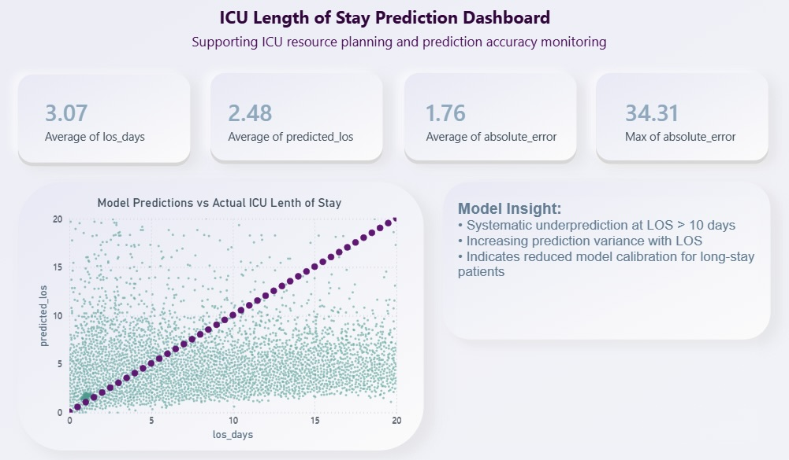

# ICU Length of Stay Prediction & Model Evaluation using BigQuery ML


---
# ICU Length-of-Stay Prediction Using MIMIC-IV

A retrospective proof-of-concept project exploring ICU length-of-stay prediction and its potential evaluation as AI-enabled decision support for capacity planning.

 

This dashboard bridges technical model outputs with clinical and operational decision-making.

---
## 📌 Project Overview


This project is a retrospective proof-of-concept study using de-identified **MIMIC-IV critical care data** to explore **ICU length-of-stay (LOS)** prediction.

The project demonstrates how routinely available clinical and administrative variables can be used to develop and evaluate a SQL-based prediction modeling workflow in **BigQuery ML**.

This project is not intended to present a clinically ready AI tool. Instead, it uses preliminary proof-of-concept work as a foundation for further methodological development, including model validation, error analysis, decision-support framing, and evaluation of potential clinical, operational, and economic value.

---

## 🎯 Research and Operational Relevance

Accurate prediction of ICU LOS enables healthcare providers to:

- 🏥 **ICU Operations:** Optimize ICU bed utilization  
- 👩‍⚕️ **Staffing & Resources:** Improve planning and allocation  
- 🔄 **Patient Flow:** Reduce bottlenecks and delays  
- 💰 **Cost Efficiency:** Support cost-effective hospital operations  

This proof-of-concept may be relevant to data-driven hospital systems interested in ICU capacity planning, patient flow, staffing, and resource allocation. However, further validation, workflow evaluation, and prospective testing would be required before any clinical or operational implementation.

---

## 📊 Dataset

- **Source:** MIMIC-IV (PhysioNet)
- **Population:** ICU patients
- **Target Variable:** Length of Stay (LOS) in days
- **Challenge:** Right-skewed distribution of LOS

✔ **Solution:** Applied log transformation to stabilize variance and improve model performance

---

## ⚙️ Methodology

### 1. Data Processing
- Extracted ICU stays from raw clinical tables
- Cleaned missing and inconsistent values
- Filtered LOS between 0–30 days to remove extreme outliers

### 2. Feature Engineering
Key features include:
- Demographics: age, gender  
- Clinical context: admission type, care unit  
- Clinical complexity: number of procedures  
- Diagnosis grouping  

### 3. Model Development
- **Model:** Linear Regression (BigQuery ML)
- **Target:** Log-transformed LOS
- **Rationale:** Improve stability and handle skewed distribution

### 4. Evaluation
- Metric: **Mean Absolute Error (MAE)**
- Evaluation performed on predicted vs actual LOS

---

## 📈 Results

The preliminary model achieved an MAE of 1.76 days in this retrospective analysis. However, performance was weaker for longer ICU stays, highlighting the importance of subgroup analysis, error interpretation, and careful evaluation before any real-world use.

**Model evaluation reveals:**
- Increasing prediction variance as LOS increases  
- Systematic underprediction for LOS > 10 days  
- Reduced calibration for long-stay patients

   ### 🧠 Model Evaluation Approach

Beyond standard error metrics, model performance was evaluated using 
visual analysis of predicted vs actual values.

A reference line (y = x) was used to assess calibration and identify 
systematic deviations in model predictions.

This approach enables deeper understanding of where the model performs well 
and where it fails — critical for real-world healthcare applications.
  
### 🔍 Key Predictive Features
- Admission type  
- Number of procedures  
- Care unit  
- Patient demographics  

---
## 📊 Dashboard (Power BI)

A Power BI dashboard was developed to translate model outputs into actionable insights.

Key capabilities:
- Visual comparison of predicted vs actual ICU LOS
- Model calibration assessment using reference line (y = x)
- Monitoring of prediction error metrics (MAE, max error)
- Identification of model limitations in long-stay patients 

Tools:
- Power BI  
- Google BigQuery integration

  ### 📊 Power BI Dashboard – Model Evaluation

To support interpretability and real-world adoption, a Power BI dashboard was developed to visualize model performance and prediction behavior.

#### Key Visuals:

- **Actual vs Predicted LOS Scatter Plot**  
  Enables direct comparison between predicted and actual ICU length of stay.

- **Reference Line (y = x)**  
  A perfect prediction line is overlaid to assess model calibration and deviation.

- **Model Performance KPIs**  
  - Average LOS  
  - Predicted LOS  
  - Mean Absolute Error (MAE)  
  - Maximum Error  

- **Insight Panel**  
  Highlights key model behavior for decision-makers.

#### Key Findings:

- Model shows **systematic underprediction for LOS > 10 days**
- **Prediction variance increases** with longer ICU stays
- Indicates **reduced model calibration for long-stay patients**

These insights are critical for identifying limitations of the model and guiding further improvements.

---
### 💡 Why This Matters

- This project demonstrates how machine learning models in healthcare must be evaluated beyond accuracy metrics.
- Understanding where models fail — particularly in long-stay ICU patients — is critical for safe and effective real-world deployment.

---
## 🧠 Key Insight

Applying a **log transformation** to ICU LOS improves model performance by addressing the strong right-skew commonly observed in hospital stay data.

This simple transformation leads to **more reliable and stable predictions**, especially for longer stays.

---

## 📁 Project Structure

```text
sql/
├── 01_extract_data.sql
├── 02_clean_data.sql
├── 03_build_dataset.sql
├── 04_engineer_features.sql
├── 05_finalize_features.sql
├── 06_train_model_log.sql
├── 07_generate_predictions.sql
├── 08_evaluate_model_mae.sql
├── 09_analyze_feature_importance.sql
```
## ▶️ How to Run
1. 📥 **Load Data**
   - Import dataset (for this project I imported MIMIC-IV dataset) into BigQuery  

2. 🧹 **Run Data Pipeline**
   - Execute SQL scripts in order:
     - `01_extract_data.sql`
     - `02_clean_data.sql`
     - `03_build_dataset.sql`
     - `04_engineer_features.sql`
     - `05_finalize_features.sql`

3. 🤖 **Train Model**
   - Run `06_train_model_log.sql` using BigQuery ML  

4. 📊 **Generate Predictions**
   - Execute `07_generate_predictions.sql`  

5. 📈 **Evaluate Performance**
   - Run `08_evaluate_model_mae.sql`  
   - Review MAE and error metrics  

6. 🔍 **Analyze Results**
   - Execute `09_analyze_feature_importance.sql`
  
 ## Limitations

- This is a retrospective analysis based on de-identified MIMIC-IV data.
- The model has not been externally validated on another hospital dataset.
- The project does not evaluate real-world clinical implementation.
- Prediction accuracy does not automatically translate into clinical, operational, or economic value.
- Long-stay ICU patients remain more difficult to predict, which is important because they may be the most operationally relevant group for capacity planning.
- Further work is needed to assess workflow integration, decision impact, health economic value, and prospective performance.

## 🚀 Future Improvements
Compare with advanced models (e.g., XGBoost, Random Forest)
Include time-series clinical variables (vitals, labs)
External validation on other hospital datasets
Integration into hospital dashboards (e.g., Power BI)

## Next Research Direction

The next stage of this work is to move beyond prediction accuracy and develop a methodological framework for evaluating the potential value of AI-enabled ICU decision support.

Future work may include:

- Translating ICU LOS predictions into decision-support categories, such as low, medium, and high expected length of stay;
- Identifying operational outcomes relevant to ICU capacity planning, such as delayed discharge, bed availability, staffing pressure, and patient flow;
- Exploring whether cost-consequence analysis or budget impact logic could be used to assess potential economic value;
- Defining the methodological requirements for future external validation and prospective hospital-based pilot evaluation.

## 👩‍💻 Author
**Olga Karachyntseva**  
**Health Economics & Data Analytics | Healthcare ML**
Bridging clinical data, machine learning, and health economics to support data-driven decision-making in healthcare systems.
